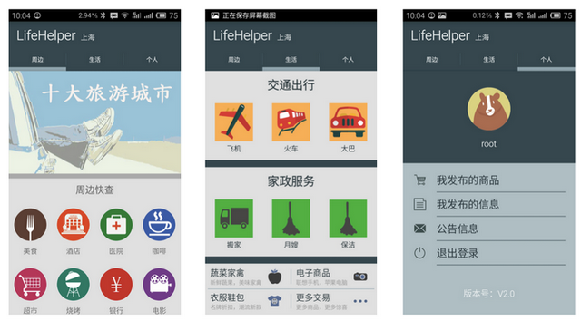

#LifeHelper

## 项目介绍
该项目的全名应该被称作“基于安卓平台的114生活助手系统的设计与实现”。我想此刻你大概也能猜到了，这是一个软件工程专业本科狗的毕设项目。因此从某种意义上来说这个项目没有任何价值和意义，至少对大部分人来说是这样的。但是作为一个历经学校繁琐复杂毕设过程的本科狗来说，我清楚的知道该项目对于那些急需应付学校毕设的同学来说一定有非凡的价值。所以，如果你是其中一位，欢迎使用我的项目。

项目主要实现的功能有如下三个 
 
1. 基于位置的周边信息查询  
2. 简易的交通信息查询  
3. 简易的个人交易商城

## 开发环境
*  AndroidStudio1.2 Beta
*  Gradle 2.2.1
*  BuildToolsVersion:21.1.2
*  CompileSDKVersion:21
*  MinSDKVersion:15

## 项目架构

## 项目包名

* com.qz.lifehelper.businss包：帮助处理应用的业务逻辑。以POIBusiness为例，通过该类可以处理所有的周边信息查询的业务逻辑。
* com.qz.lifehelper.dao包：该包是由dao_generator自动生成的，通过该包实现数据库的存储与访问。这里使用的ORM框架是GreenDAO。
* com.qz.lfehelper.entity包: 该包内主要是项目用到的各种数据类型，似乎大家一般习惯将该包命名为model。在该包内还有子包json，json包内主要是json数据使用到的数据类型。
* com.qz.lifehelper.event包：由于项目使用了EventBus处理部分组件间的事件分发，因此相关的Event被存放在了该包中。
* com.qz.lifehelper.helper包：事实上这是一个遗留包。原本的设想是将大量的逻辑代码从Activiy和Fragment中移除到Helper包中。但是后期发现该包与Businss包有很多重合。因此在后期的编码中实际已经被遗弃。
* com.qz.lifehelper.persist包：该包主要负责项目数据的持续化。具体的来说对于File和SharedPreference的操作都被封装到了这里。
* com.qz.lifehelper.service包： 该包主要负责项目的服务器数据的获取。注意的是由于项目需求的需要，该包内实际上有一个在线服务器和一个离线服务器。
* com.qz.lifehelper.ui包：项目的Activity、Fragment、Adapter、View都放在该包中。事实上取名为ui包还是很不合理的。
* com.qz.lifehelper.utils包：项目中使用到的一些工具类。

## 数据获取

由于项目的需求，项目当中获取的数据主要分为两大类。一种是用户和项目运维的自产数据，另外一类是来自互联网的数据。其中自产数据使用了LeanCloud的云数据存储服务和七牛云的云文件存储服务。而互联网数据主要采用的是百度的POI云服务和聚合数据的云服务。其中从百度的POI云服务中获取周边信息，聚合数据的云服务中获取交通信息数据。

另外为了满足答辩时项目演示的需求，所以项目又实现来一套完整的基于数据库的离线服务器。项目默认的情况下使用的是离线服务器，如果需要在在线服务器与离线服务器之间切换，请连续点击项目首页的个人页面中底部版本号5次。这里要注意的是，离线服务器的数据非常不全，只能查询上海的周边信息数据和极少数城市的交通信息。

## 为什么项目打包后这么大

根本的原因是，大量的图片被一起打包到了项目当中。一提到这个设计，眼泪就不禁流了下来。想我当初终于实现了数据的网络获取，结果到答辩教室一测试，发现那里没有任何网络。于是苦逼的我只好再实现一套完整的离线数据服务器。而所有相关的数据就被一起打包到了APK当中。如果你想要在离线服务器和在线服务器之间切换，你可以参考上一节的内容。

## 使用的开源技术

在整个项目的实现当中，使用了大量的开源技术。他们包括： 
 
1. AndroidAnnotation，一个Android的依赖注入框架，通过他减少了大量的不必要代码。  
2. Gson，项目的json序列化和反序列化都采用了该项目。  
3. EventBus,项目的部分组件，使用了EventBus实现事件分发
4. Bolts，这是Facebook和Parse的一个底层开源框架，在项目中我主要用它处理异步操作的代码。该框架在国内似乎并不流行，但是相信我非常好用。
5. Reftrofit，square的一个快速实现RESTFul API接口的框架。
6. Picassio，square的一个图片框架。感觉比universal-image-loader简单很多。
7. GreenDao，Android的ORM框架。这里主要用它实现离线数据服务器。
8. Apache Commons IO，好吧我承认在Android中应该尽量少用这个框架，否则很容易造成方法数超标。但是它真的很好用。

## 项目修改

由于项目使用了大量的云服务，而项目在我完成答辩后就不再继续维护了。所以这些云服务很有可能在你使用该项目时已经失效。为了能够使得项目正常的运转起来，你可能需要重新配置下面这些文件。  

* com.qz.lifehelper.service.JuheConstant中封装了聚合网云服务使用到的SERVICE_KEY,这些KEY决定了交通信息查询系统能不能正常的运行。
* com.qz.lifehelper.service.LeancloudConstant中封装了Leancloud与服务使用的SERVICE_KEY,改KEY决定了项目的周边信息查询、个人在线交易市场、用户身份验证能不能正常使用。
* com.qz.lifehelper.service.QiniuyunCOnstant中封装了七牛云服务使用的SERVICE_KEY，如果图片服务出现了问题，需要修改该SERVICE_KEY。
* 项目当中使用到的离线数据都被封装到了assets当中。其中db文件是离线服务器使用的数据库，其将会在第一次打开应用时被导入。除了使用数据库作为离线服务器之外，部分的离线数据还使用了json数据进行存储。

## 补充
1. 在项目的开发过程当中，使用的都是debug模式编译。因此没有对项目进行混淆，因此打包成发布版时必定会出现混淆造成的问题。
2. 项目的实现的目标是以完成毕设为目标，因此项目当中存在很多在其他项目当中不存在的问题。如果存在什么疑问，可以直接在issue中提出。但是由于该项目已经不再继续维护，因此将不保证能够得到有效回复。
3. 项目由于使用了百度地图SDK，因此似乎只能在arm的虚拟机上运行。对于使用Geneymotion的同学，只能说对不起了。

